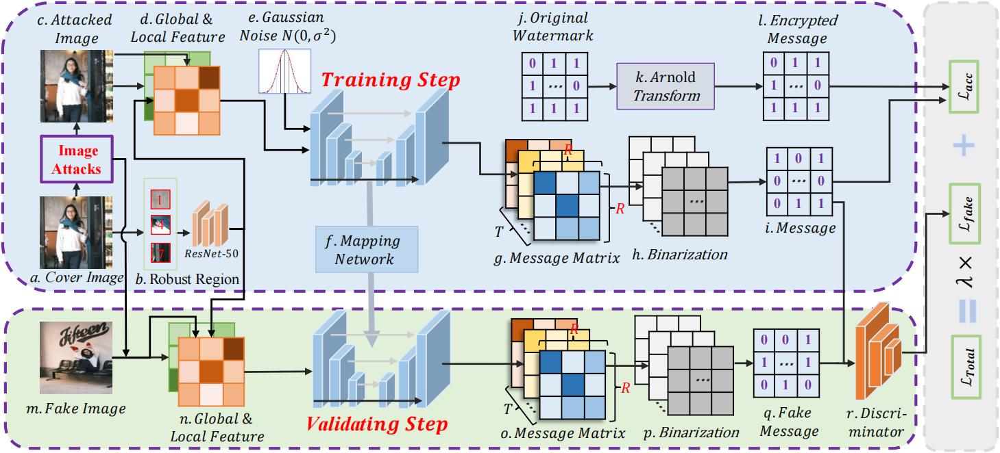

# RobAF-Mark
This repository is the official implementation of paper：RobAF-Mark: Robust Adversarial Fusion of Local-Global Features for Coverless Watermarking.
# What is RobAF-Mark?
Coverless watermarking (CoMark) has been widely adopted for image anti-counterfeiting traceability of high-quality features because of the advantage of non-destructive feature mapping. However, the current CoMark framework still suffers from the problems of insufficient fusion of features, weak anti-perturbation of the mapping network, and low unauthorized image discrimination performance. To address the above problems, we propose a robust and security adversarial deep learning CoMark mapping network based on the fusion of local filtered features and global handcrafted features, dubbed RobAF-Mark. 
We enhance the robustness of our proposed framework by incorporating image perturbation and Gaussian noise into the training process. Adversarial learning is employed to significantly improve the security of the framework, which can achieve the false positive value of fake images close to random guessing ($\sim0.5$). We provide an in-depth analysis of the critical parameters, including Gaussian noise, watermark dimensions, and weighting factors, exploring their impact on the performance of our RobAF-Mark. Extensive comparative experimental results indicate that our proposed robust adversarial deep learning-based RobAf-Mark framework has better robustness and security.

# Requirements
Prior to run the codes you need the packages mentioned in the file requirements.txt. You can install the dependencies by
```setup
pip install -r requirements.txt
```
# How to use
To run the codes, you need to flow the following three steps:
Step 1: Attacking images
```
python attack_all.py
```
Step 2: Obtain the features of the image
```
python get_other_features.py
python get_our_features.py
```
Step 3: Training and testing the RobAF-Mark framework
```
python Base_Test.py
```
# Dataset
We use the Kodak24 dataset for training and testing. You can download the dataset from the official website: 
https://r0k.us/graphics/kodak/
We also used the COCO2014, Mirflickr, and TCGA-READ datasets in our paper, which can be obtained at the following links:
https://cocodataset.org/#download
https://press.liacs.nl/mirflickr/mirdownload.html
https://wiki.cancerimagingarchive.net/pages/viewpage.action?pageId=6881474
# Citation